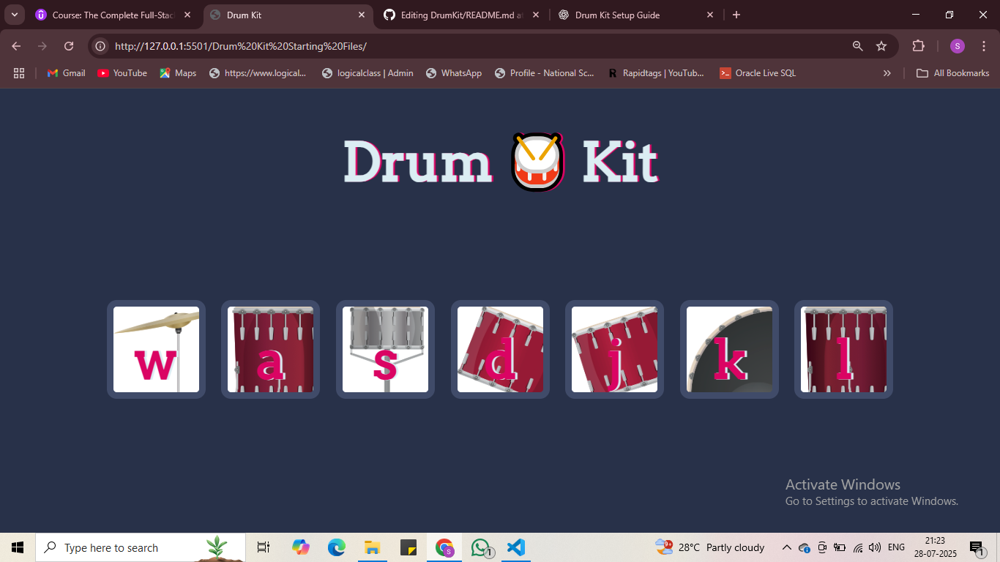

# Drum Kit 🥁

This is a simple drum kit web app built using **HTML**, **CSS**, and **JavaScript**.

Press the keys (`w`, `a`, `s`, `d`, `j`, `k`, `l`) or click the buttons to play different drum sounds.

## Features
- Interactive key press & click
- Sound effects
- Minimalist UI

## Live Demo
[ https://saideepthich-17.github.io/DrumKit/]

## Preview

